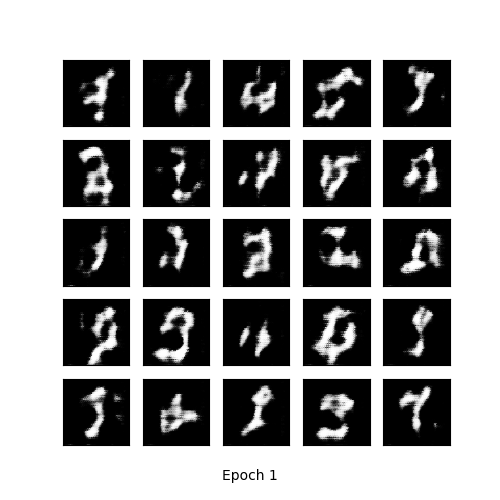

# Project for IFT 6760-A: Matrix and tensor factorization techniques for machine learning 
Project in collaboration with [NBerty](https://github.com/NBerty) and [tobicarvalho](https://github.com/tobicarvalho). Pytorch implementation of a tensorized DCGAN on various Datasets, Cifar-10, MNIST and SVHN. The code is inspired by https://github.com/timgaripov/TensorNet-TF tensorflow code. The vanilla DCGAN model will be compared to a fully (or partially) tensorized DCGAN model. The training of the convolutional and linear layers can be made in the tensor-train format. To use the code you only have to clone the repository with the command:

```bash
git clone https://github.com/jimleroux/tensor_factorization.git
```

To train the GAN, start by pretraining the weights with an autoencoder use:    

```bash
python train_ae.py --config add_the_config_file_you_want.json
```  

After you can train the GAN model with:

```bash
python train_net.py --config add_the_config_file_you_want.json --pre_trained --fc_tensorized
```

You can monitor the training by looking at the images in `MNIST_DCGAN_results` folder which will be created during training. Here's an exemple of the generated samples with the fully tensorized (34 080 parameters) TT-DCGAN as the training goes.


